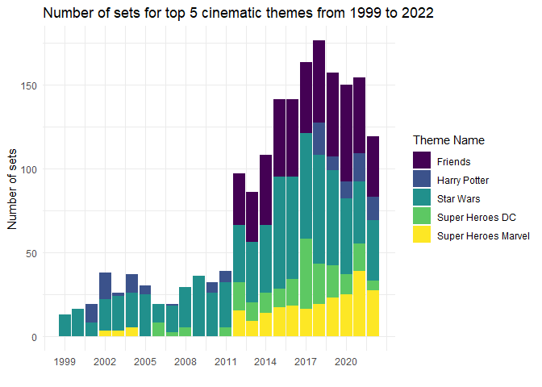

LEGO Sets
================
yq
2023-11-29

#### Importing libraries and data

``` r
#importing data and libraries
library(tidyverse)
library(tidytuesdayR)
library(ggrepel)
library(ggthemes)
library(viridis)

url='https://raw.githubusercontent.com/rfordatascience/tidytuesday/master/data/2022/2022-09-06/'

sets <- readr::read_csv(paste0(url, 'sets.csv.gz'))
themes <- readr::read_csv(paste0(url, 'themes.csv.gz'))
```

## Introduction

The LEGO data set consists of data from the Rebrickable database. Every
official LEGO’s parts, sets, colours and inventory data can be obtained
from the following data set. In this case study, we will be delving into
the question: **What should manufacturers take into consideration when
making a new LEGO set?** We find this to be an important question as
manufacturers have the main goal of maximising profits from an
introduction of a new LEGO set, hence would benefit from releasing a
LEGO set that has the highest potential of becoming popular. This
question would help manufacturers to narrow down on what themes to focus
their efforts on, and we will evaluate the sets based on its
sustainability and popularity in the long run and the size of a set in
terms of the number of parts it has. We will be focusing on the sets and
themes datasets to answer the question. In the sets dataset, the
variables `year`, `num_parts`, `theme_id` and `set_num` will be of
interest. The `year` consists of the year that a LEGO set was released,
`num_parts` indicates the number of parts in a set ,`theme_id` is the
theme of a set, while `set_num` is an ID for each unique set. In the
themes dataset, the variables `id` and `parent_id` will be of interest.
The `id` is the unique ID for each theme, inclusive of both main and sub
themes. Whereas the `parent_id` is the overarching theme of a sub theme,
only present if the theme is a sub theme. It is expected that the
popularity of a LEGO set can be influenced by multiple factors. In this
case, we will make the assumption that manufacturers continue to sell
sets as they believe there is sustained interest or potential for growth
in that theme.

## Data cleaning & Summary

``` r
sets %>% filter(num_parts == 0) %>% count()
```

    ## # A tibble: 1 × 1
    ##       n
    ##   <int>
    ## 1  3630

There exist 3630 rows of sets with 0 number of parts. As we are unsure
if it was due to an error when the data was collected or other reasons,
we decided to remove them from the data set to ensure that our analysis
is focused on instances when the Lego set actually contains parts, as
sets with no parts provide no meaning to the question that we are
investigating.

``` r
sets = sets %>% filter(num_parts != 0)

n_themes = themes %>% count()
themes %>% head(3)
```

    ## # A tibble: 3 × 3
    ##      id name           parent_id
    ##   <dbl> <chr>              <dbl>
    ## 1     1 Technic               NA
    ## 2     3 Competition            1
    ## 3     4 Expert Builder         1

There are 445 total themes during the initial observation, however upon
closer inspection, we identified that there are sub-themes within
themes. For example, the themes *Airport*, *Cargo* and *Construction*
have the same `parent_id` of 52 which is the `id` of the theme *City*.
Therefore we decided to classify them under the base theme of *City* to
reduce the number of total themes. This is also done as sub-themes are
closely related to each other and their parent themes, combining them
under the same base theme helps to reduce redundancy in the analysis
later on.

``` r
theme_base = themes %>%
  left_join(themes, by=c("parent_id" = "id"), suffix = c("", "_parent"))

theme_base %>% filter(!is.na(parent_id_parent)) %>% count() %>% pull()
```

    ## [1] 22

After self-joining, there is still another layer of parent themes, so we
self-join again.

``` r
theme_base = theme_base %>%
  left_join(theme_base, by=c("parent_id_parent" = "id"),
            suffix = c("", "_parent")) %>%
  select(-8, -9)

theme_base %>% filter(!is.na(parent_id_parent_parent)) %>%
  count() %>% pull()
```

    ## [1] 0

Since there are no more parent themes, there are only 3 layers of
themes, and we do not have to self join again. We then clean the
`theme_base` table, showing only the base theme for each `theme_id`

``` r
theme_base = theme_base %>%
  select(-5, -7, name_root = name_parent_parent) %>%
  mutate(name_parent = ifelse(is.na(name_parent), name, name_parent)) %>%
  mutate(name_root = ifelse(is.na(name_root), name_parent, name_root)) %>%
  select(id, theme_name = name_root)

n_basethemes = theme_base %>% select(theme_name) %>%
  unique() %>% count() %>% pull()
```

We have narrowed down 445 themes to 141 base themes. This will help to
provide a more concise representation of the main themes, allowing us to
extract key insights at a higher level which is valuable as we are
analysing the overarching trends, for manufacturers and stakeholders.

We then join the `sets` table with the `theme_base` table, naming it
`sets_with_themes` so the `theme` column is in the table.

``` r
sets_with_themes <- sets %>%
  left_join(theme_base, by = c("theme_id" = "id"))
```

We observed that there is a theme named *Other*, which is usually used
to classify miscellaneous items that do not fit into any of the
predefined main themes. This category lacks specific information and
provides little to no insight to the data, hence we decided to remove it
to improve clarity as we are focusing on meaningful information that
manufacturers can act upon. We also remove the `img_url` column as we do
not use it for our analysis.

``` r
theme_base = theme_base %>%
  filter(theme_name != "Other")
sets_with_themes = sets_with_themes %>%
  filter(theme_name != "Other") %>%
  select(!img_url)

n_sets = sets_with_themes %>% count() %>% pull()
sets_with_themes %>% summarize(max_parts = max(num_parts), min_parts = min(num_parts))
```

    ## # A tibble: 1 × 2
    ##   max_parts min_parts
    ##       <dbl>     <dbl>
    ## 1     11695         1

Our cleaned main table to be used for data analysis, `sets_with_themes`
has a total of 16079 rows, with number of parts ranging from 1 to 11695,
each of them having a theme from a pool of 141 main themes. \## Data
Visualisations

### Visualisation 1: Compare Number Of Years In Production of the Top 15 Most Popular Themes and looking at their Number of Lego Sets Produced

``` r
sets_with_themes %>%
  group_by(theme_name) %>%
  mutate(diff = max(year)- min(year), count=n()) %>%
  select(theme_name,diff,count) %>%
  distinct()%>%
  arrange(desc(count))%>%
  head(15)%>%
  select(theme_name,diff,count)-> popularity

ggplot(data = popularity, aes(x = count, y = diff)) +
  geom_point()+
  geom_smooth(method = "loess", se=F, span=0.7, col = viridis(1)) +
  geom_text_repel(aes(label= str_to_title(theme_name)))+
  theme_minimal() +
    labs(title="Number of Lego Sets and Years In Production for the Top 50 themes",
       x = "Number of Lego Sets Produced", y = "Years In Production") +
  theme(panel.grid.minor = element_blank(),panel.grid.major.x =
          element_blank(),plot.title = element_text(hjust = 0.5, face = "bold"),
        axis.title.y = element_text(margin=margin(r=15)),
        axis.title.x = element_text(margin=margin(t=10))) -> Figure_1

Figure_1
```


For this visualisation, we will be visualising the relationship of
number of Lego sets and years in production of the Top 15 most popular
themes. We will be assuming that themes with a higher number of Lego
sets are more popular. We will be using `sets_with_themes` dataset,
which was composed of the self joining of `themes` and a left join onto
`sets` dataset as shown in the data cleaning above. Here, 2 new
variables are created. The data is grouped by `theme_names` and the
variable `diff` calculates the difference between the maximum and
minimum years within each group, yielding the number of years each main
theme has been in production. While the `count` variable represents the
number of lego sets under each main theme.

For visualisation purposes, only the top 15 most popular themes, based
on their number of Lego sets, are included in the plot. A scatterplot is
well suited here as it provides a clear visualisation of the
relationship between the 2 continuous variables and also underlying
patterns. A regression line fitted using the Loess method is also
plotted as it helps highlight the overall and underlying trend. In
addition, the text labels enable us to discern which particular themes
are more sustainable, in terms of longer years in production, and
popular, in terms of their number of Lego sets, which grants us more
information.

In Figure 1, we are able to discern a general upward trend between the
years in production of the top 15 themes and their number of lego sets.
This helps us to understand that themes with higher popularity, in terms
of their number of Lego sets, are more likely to be sustainable as well.
This association is a good consideration for manufacturers to take into
account. In particular, we can also identify that *Educational and
Dacta* and *Duplo* themes stand out significantly in terms of their
sustainability and popularity. These themes are possible reliable
choices for the production of new lego sets that manufacturers can
consider. In addition, we can observe that the trend line takes a dip in
the middle of the graph, this is likely due to themes such as *City*,
*Star Wars* and *Collectible Minifigures* that have a high number of
Lego sets despite only being in production for a short term. Thus, these
themes are possible emerging choices in terms of popularity as compared
to the other themes that can be taken into consideration by the
manufacturer as well in making new lego sets.

### Visualisation 2: Observing how complexity of theme affects popularity in the top themes in recent years

``` r
#Collectible Minifigures are removed as they are 
#a special type of theme with an extremely low # of parts,
#which is not useful in our specific analysis for this visualization
top_theme_1222 = sets_with_themes %>%
  filter(between(year, 2012, 2022), theme_name != "Collectible Minifigures") %>%
  count(theme_name, sort=TRUE) %>%
  head(6) %>% pull(theme_name)

theme_count = sets_with_themes %>%
  filter(theme_name %in% top_theme_1222, between(year, 2012, 2022)) %>%
  group_by(year) %>%
  count(theme_name)

sets_with_themes %>%
  filter(theme_name %in% top_theme_1222, between(year, 2012, 2022)) %>%
  ggplot() +
  geom_boxplot(aes(year, num_parts, group = year), col = viridis(1)) +
  geom_line(data = theme_count, aes(year, n), col=viridis(4)[2], lwd = 0.75) +
  scale_y_log10(sec.axis = sec_axis(trans=~.*1,
                                    name = "# of parts (boxplot)")) +
  scale_x_continuous(breaks = seq(2012, 2022, 2)) +
  facet_wrap(~theme_name) +
  labs(title = "Theme popularity (line) & distribution of # of parts (boxplot)",
       x="", y="# of sets (line)") +
  theme_minimal() +
  theme(plot.title = element_text(size = 16),
        axis.text = element_text(size = 8),
        axis.title = element_text(size = 9)) -> Figure_2

Figure_2
```


This visualisation offers a comprehensive exploration of the
relationship between the popularity and complexity of LEGO themes from
2012 to 2022, focusing on the top 6 themes (based on number of sets
released during 2012-2022). The line graph charts the annual evolution
of each theme by depicting the number of sets released over the 10-year
period, which serves as a proxy for theme popularity, as an increasing
number of sets released might signify sustained interest and demand. The
boxplots display the distribution of the number of LEGO parts in the
sets each year, which provide a nuanced perspective on the complexity of
sets within each theme.

A notable trend that emerges from the analysis is the inverse
relationship between the number of themes released and the median of the
boxplot. For instance, the observed patterns in themes like *Ninjago*,
*Star Wars*, *City*, and *Friends* unveil intriguing dynamics. The
visual examination of *Ninjago* reveals a significant drop in the number
of themes from 2012 to 2014, juxtaposed with an increase in median
complexity during the same period, followed by a resurgence in both
metrics in 2015. Similar patterns in *Star Wars*, *City*, and *Friends*
themes echo this inverse relationship across the decade.

This overlay of line graphs and boxplots serves as a powerful analytical
tool, allowing us to discern patterns and correlations that might be
overlooked when examining each aspect independently. By simultaneously
considering popularity and complexity, the visualisation provides a
holistic understanding of the top LEGO themes, empowering manufacturers
with valuable insights into the factors influencing a set’s success.
Manufacturers should carefully weigh the trade-off between releasing a
diverse array of themes and maintaining the complexity of individual
sets, as this delicate balance can greatly impact the market reception
of LEGO products.

### Visualisation 3: Popularity of movie/tv series and the influence of the number of its lego themes across 1999 to 2022.

``` r
top_themes = sets_with_themes %>% count(theme_name, sort = TRUE) %>% head(35)

#manually extracting themes that are TV Shows/Movies
shows = c("Star Wars", "Friends", "Super Heroes Marvel", "Super Heroes DC", "Harry Potter")

sets_with_themes %>% filter(theme_name %in% shows) %>%
  group_by(year) %>%
  count(theme_name) %>%
  ggplot(aes(x = year, y = n, fill = theme_name)) +
  geom_col() + 
  scale_x_continuous(breaks = seq(1999,2022,3)) + 
  labs(title = "Number of sets for top 5 cinematic themes from 1999 to 2022",
       x = "", y = "Number of sets", fill = "Theme Name") +
  scale_fill_viridis_d() +  
  theme_minimal() -> Figure_3

Figure_3
```



The stacked bar plot shows the change in number of sets of top 5
cinematic lego themes across the years 1999 to 2022 (The first set with
a cinematic theme was introduced in 1999). Each bar shows the proportion
of cinematic themes for that year, with the themes grouped by colour.

A stacked bar plot is a suitable visualisation as it shows the change in
the total number of lego sets for the top 5 themes. For each year as
signified by a bar, we can clearly see the proportion of each theme in a
single year. This allows us to see what themes dominated the lego sets,
and allows us to check if this corresponds to events such as the release
of a movie/show for that theme, thus incentivising manufacturers to
produce more lego sets in a theme.

For example, Harry Potter, an incredibly popular book series, aired its
first film in 2001. This corresponds with an increase in the number of
Harry Potter themed lego sets as manufacturers viewed the popularity of
the film as an opportune moment to sell similarly themed LEGO sets to
its fans, which was released in 2001. Similarly, Friends, a hugely
popular TV series, was aired from 1994 to 2004. However, the first
Friends themed lego sets were only released in January 2012, but
remained a very popular lego theme till 2022. We can infer that despite
releasing its related LEGO sets much later after the show had already
run, it was still feasible and profitable for manufacturers to produce
sets on the films as the public may still enjoy references on the film
and were keen on purchasing collectibles such as its LEGO sets. In
addition, DC movies became popular after 2012, having the largest number
of sets in 2017 possibly due to the release of two DC movies as compared
to one movie in other years.

## Discussions

The visualisations presented aim to guide LEGO manufacturers in making
informed decisions when creating new sets. The first visualisation, a
scatter plot depicting the longevity and popularity of main themes,
emphasising themes that have endured over time and present growth
opportunities. The second visualisation explores the delicate balance
between popularity and complexity of LEGO themes from 2012 to 2022,
revealing an inverse relationship between the number of themes released
and the median complexity of sets. Insights from specific themes
underscore the importance of considering both quantity and intricacy in
new set introductions. The third visualisation, a stacked bar plot
focusing on cinematic themes, provides insights into the impact of media
events on LEGO set production, allowing manufacturers to strategically
align releases with significant cinematic or television content.

In conclusion, the visualisations collectively offer manufacturers a
comprehensive perspective on theme selection, longevity, and strategic
alignment with media events. They underscore the need to balance
popularity and complexity in new set introductions, empowering
manufacturers to navigate the intricate landscape of LEGO set production
with strategic foresight. These insights facilitate informed
decision-making, ensuring that manufacturers capitalise on sustained
themes, identify growth opportunities, and strategically align with
media trends for maximum market impact.

## References:

Lego sets. GitHub. (2022, September 6).
<https://github.com/rfordatascience/tidytuesday/tree/master/data/2022/2022-09-06>  
DCEU movies in order – DCEU timeline and chronological order - odeon.
(n.d.). <https://www.odeon.co.uk/odeon-scene/dceu-movies-in-order/>
